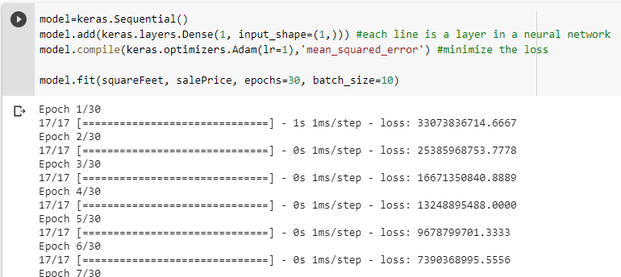
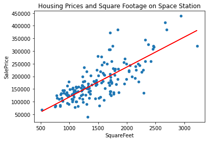
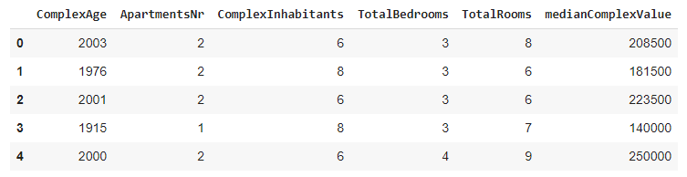
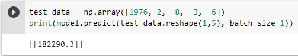

# Laboratory 3

For this laboratory work, we had to predict the price of a house on the "Golden Rule" space station, based on some information found. 
The information states the criteria based on which the price of a house is computed, such as age, number of apartments, number of rooms, number of inhabitants, etc.

### Prerequisites:

- Google Colab Notebooks
- Keras
- Google Drive

### The 1st step

Iitially, we wanted to see how liniar regression works when the price of a house depends solely on one characteristic, for instance, Square Footage of the complex. 
For that we need jus one neural layer, as shown in the Figure below. Also, we minimized the loss by using the 'mean_squared_error' function. 
The epochs are the number of iterations, which we set to 30.

It is important to mention that for plotting the graph, the matplotlib.pyplot library was used. X was set to equal the square feet of the complex, while Y was set
to equal the housing prices. The plot is shown below.

Lastly, we wanted to predict what would be the price for a complex with a square footage of 200, and the result was 23788.436

### The 2nd step Deep Neuronal Network (DNN)

In real life, as well as in our task, the price of a house is not determined solely on one characteristic, so we introduced, as the X coordinate the following criteria:
ComplexAge, ApartmentNR, TotalRooms, TotalBedrooms, complexInhabitants. These would eventually determine the medianComplexValue, or, in other words, the price. Because
we have multiple criteria, multiple neurons will be initialized in our network.
We created a .csv file with all the historical data. The stucture of the data is shown in the Figure below.

After that we defined 3 neuronal layers. As an activation function they use 'relu' - rectified liniar units, which normalizes the values on a scale from 0 to 1.
When fitting the model, we use as a parameter, the keras.callbacks.EarlyStopping function, to avoid overfitting of the model. We gave a total number of epochs of 100.
Finally, we tested our model by tacking some values already existent and analyzing the similarity of the computed result, to the one in the database.

The correct result: 181500
The computed result: 182290.3

Pretty close. The testing of the model is shown in the image below.

