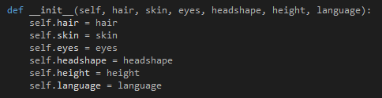

# Artificial-Intelligence-Fundamentals

The system allows the user to answer some questions about a
possible tourist. If the set of given answers matches a type of tourist from the database, this
is the system’s answer. If on the other hand, the system determines that the person
in question is a Loonie, the answer is accordingly.
The system simulates the human decision-making process.

**The system has 3 files:**
- Citizen.py
- TouristTypes.py
- Result.py

### Citizen Class
The citizen's behaviour is defined in the Citizen.py file within the Citizen class. It has two methods, one of which is the constructor.
In the constructor, we defined the main characteristics of any citizen as a general rule, be it a tourist or a Loonie, 
such as having, hair, eyes, skin, headshape, height and language spoken.
The constructor is represented in the Figure below.

Also, the Citizen class holds a compliance degree method that is responsible for deciding upon the type of the citizen described by the user.
The way it works is that it counts the similarities between the user's input and the characteristics of each type. The type that got the most points
is the one that is going to be returned to the user.

### TouristTypes Class
The definition of all the tourist types existent is done in the TouristTypes.py file. The most important class is the class TouristTypes 
which holds a constructor that assigns to itself five types of citizens: Loonie(although not a tourist), Earthie, Mercurian, Plutonian and Jupitarian. 
These are defined as separate classes within the same file. Each of these have constructors that assigns them particular characteristics for the attributes
inherited from the citizen. The Loonie class is sown in the following Figure.

